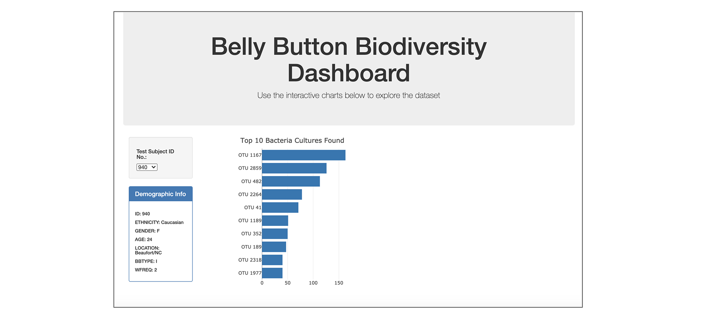
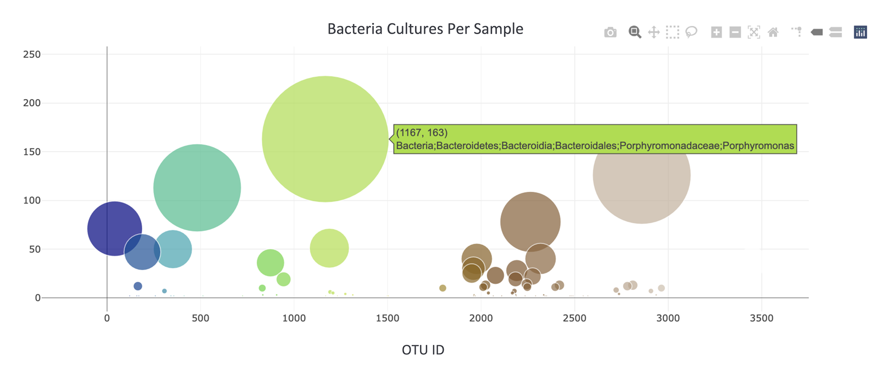
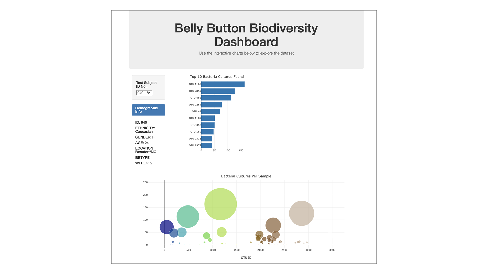
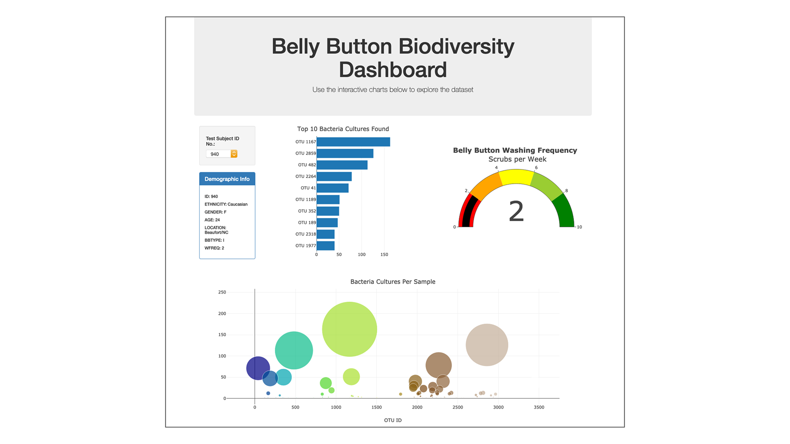

# Plotly-Belly-Button-Biodiversity

## Overview
This project is to complete panel/dashboard for demographic information and needs to visualize the bacterial data per filtering. Specifically, this project should be able to identify the top 10 bacterial species in the belly buttons. That way, if Improbable Beef identifies a species as a candidate to manufacture synthetic beef, we will be able to identify whether that species is found in their navel.

## Results:
- The bar chart below was filtered on the left

- The bubble chart is as below

- The horizontal dashboard is below

- The final complete interactive dashboard is as following

